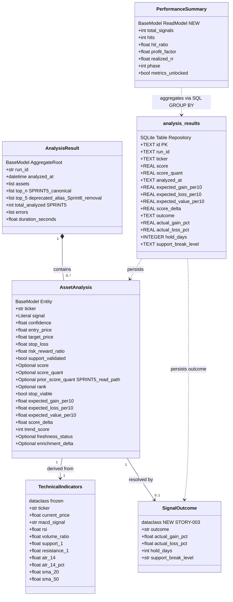
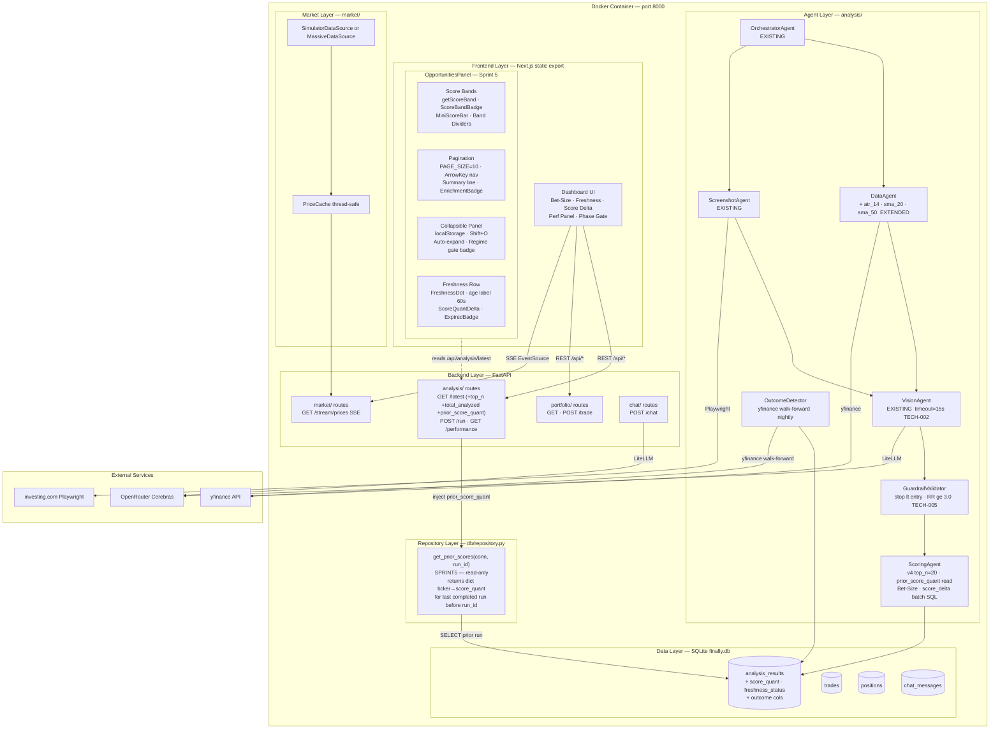
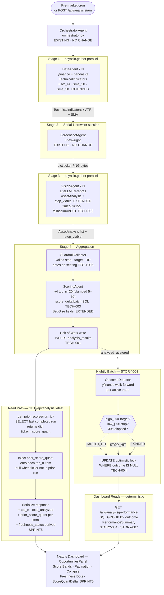
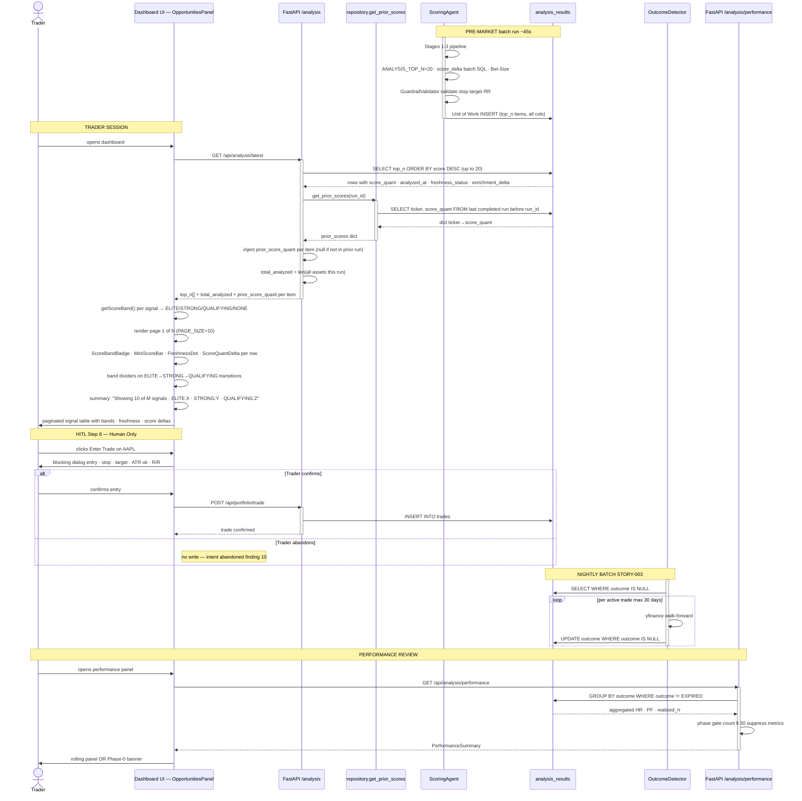
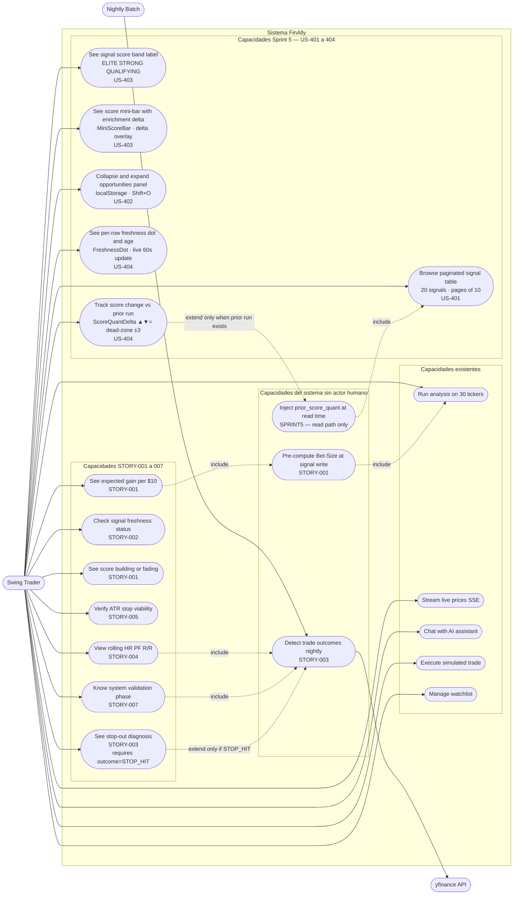
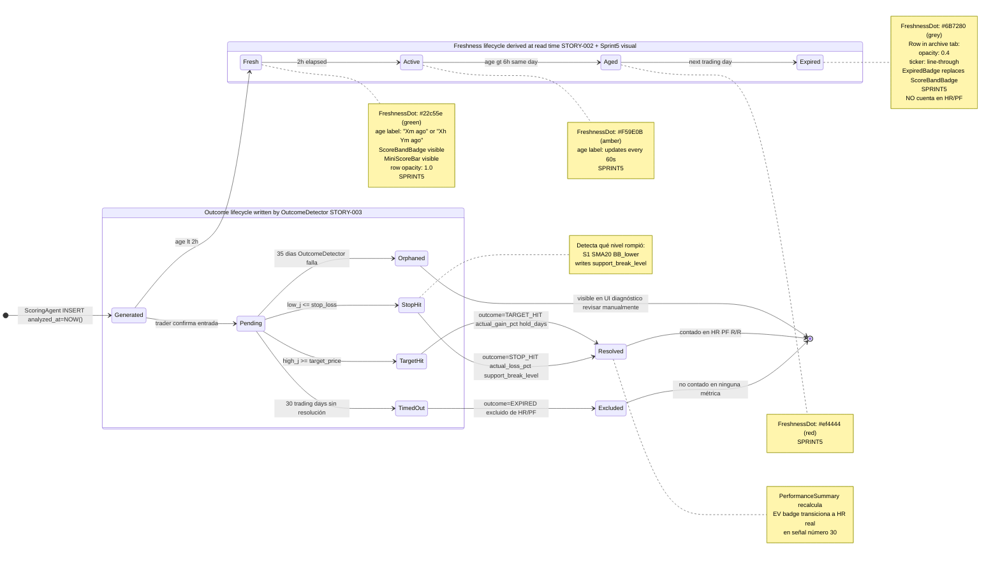
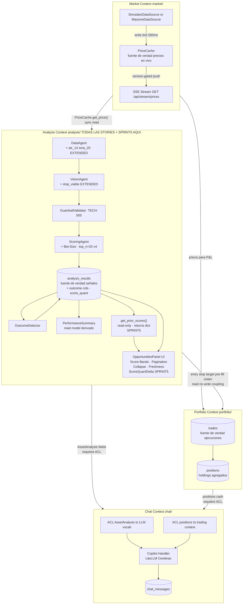

# Domain Architecture — FinAlly MVP
**Skill**: L4-B Domain Architecture Diagrams  
**Scope**: STORY-001 → STORY-007 + US-401 → US-404 (Sprint 5)  
**Framework**: DDD (Evans) + DDIA (Kleppmann) + Evaluación Sistémica  
**Date**: 2026-06-27 _(updated from 2026-05-23)_

---

## 1. Existing Domain Inventory

Baseline antes de cualquier story. Todo lo nuevo es **aditivo** sobre esta tabla.

| Name | DDD Type | Python Type | File | Key Fields |
|------|----------|-------------|------|------------|
| `TechnicalIndicators` | Value Object | `frozen dataclass` | `data_agent.py` | ticker, macd_signal, rsi, volume_ratio, support_1/2, resistance_1/2 |
| `AssetAnalysis` | Entity | `Pydantic BaseModel` | `models.py` | ticker, signal, confidence, entry/target/stop, rr, support_validated, score, rank, score_quant, prior_score_quant _(Sprint 5)_ |
| `AnalysisResult` | Aggregate Root | `Pydantic BaseModel` | `models.py` | run_id, analyzed_at, assets[], top_n[] _(canonical)_, top_5[] _(deprecated alias)_, total_analyzed _(Sprint 5)_, errors[], duration_seconds |
| `PriceUpdate` | Value Object | `frozen dataclass (slots)` | `market/models.py` | ticker, price, previous_price, timestamp, change, direction |
| `PriceCache` | Domain Service | `class` | `market/cache.py` | _prices, _version, _lock |

| Agent | File | Stage | Input → Output | Status |
|-------|------|-------|----------------|--------|
| `OrchestratorAgent` | `orchestrator.py` | Root | `[tickers]` → `AnalysisResult` | ✅ spec completo |
| `DataAgent` | `data_agent.py` | Stage 1 ‖ | `ticker` → `TechnicalIndicators` | ✅ spec completo |
| `ScreenshotAgent` | `screenshot_agent.py` | Stage 2 → | `[tickers]` → `dict[str, bytes]` | ✅ spec completo |
| `VisionAgent` | `vision_agent.py` | Stage 3 ‖ | `ticker + indicators + bytes` → `AssetAnalysis` | ✅ spec completo |
| `ScoringAgent` | `scoring_agent.py` | Stage 4 | `[AssetAnalysis]` → `[ranked, top_n=20]` | ✅ Enhancement v4 — top_n=20, prior_score_quant |

**Sprint 5 — Frontend Components (US-401–404)**

| Component | Type | File | Purpose |
|-----------|------|------|---------|
| `getScoreBand(score)` | Utility function | `OpportunitiesPanel.tsx` | Maps score → ELITE/STRONG/QUALIFYING/NONE |
| `ScoreBandBadge` | React component | `OpportunitiesPanel.tsx` | Per-row band label with colored border |
| `MiniScoreBar` | React component | `OpportunitiesPanel.tsx` | 64px bar at score_quant% + enrichment_delta overlay |
| `FreshnessDot` | React component | `OpportunitiesPanel.tsx` | 8px colored dot keyed on freshness_status |
| `ScoreQuantDelta` | React component | `OpportunitiesPanel.tsx` | ▲/▼/= vs prior run, dead-zone ±3 |
| `EnrichmentBadge` | React component | `OpportunitiesPanel.tsx` | +N/−N visual badge per enrichment_delta |
| `ExpiredBadge` | React component | `OpportunitiesPanel.tsx` | Replaces ScoreBandBadge in archive tab |
| Pagination controls | UI state | `OpportunitiesPanel.tsx` | PAGE_SIZE=10, keyboard ArrowLeft/Right, currentPage resets on new run |
| Collapsible panel | UI state | `OpportunitiesPanel.tsx` | localStorage persisted, Shift+O shortcut, auto-expand on run, regime gate badge |

---

## 2. Class Diagram

`AnalysisResult` es el aggregate root (DDD): agrupa `AssetAnalysis` y garantiza la consistencia de un run completo. Las stories STORY-001 a STORY-007 + US-401–US-404 son puramente aditivas. Sprint 5 agrega: `top_n` como campo canónico en `AnalysisResult` (`top_5` queda como deprecated alias removible en Sprint 6), `total_analyzed` para contexto de cobertura en la UI, y `prior_score_quant` en `AssetAnalysis` que se inyecta en el read path (no se persiste) mediante `get_prior_scores()` en `repository.py`. `SignalOutcome` es un nuevo value object que se escribe exactamente una vez por `OutcomeDetector`. `PerformanceSummary` es un read model derivado puro.



> **Sprint 5 note**: `prior_score_quant` is **not stored** in `analysis_results`. It is derived at API read time by `get_prior_scores(conn, run_id)` which finds the last completed run before `run_id` and returns `{ticker: score_quant}`. This keeps the write path unchanged and avoids a schema migration.

---

## 3. Architecture Diagram

El sistema vive en un único contenedor Docker — restricción hard del repo (DDIA: single-node architecture con SQLite como store único). Las stories no rompen este boundary: cero nuevos servicios, cero nuevos puertos. El `OrchestratorAgent` es el application service (DDD) que coordina los agentes de dominio; FastAPI es la interfaz de entrada sin lógica de negocio. Sprint 5 es puramente frontend: 9 nuevos componentes visuales en `OpportunitiesPanel.tsx`, ningún cambio al write path del backend (excepción: `get_prior_scores()` es una nueva query de solo lectura).



---

## 4. Orchestration Diagram

La pipeline de 4 stages es el **write path** (DDIA): transforma datos externos en `AssetAnalysis` persistidos en `analysis_results`, costosa en tiempo (~45s batch), ejecutada una vez por run. Los dashboards son el **read path**: lecturas pre-computadas sub-200ms. Sprint 5 no modifica la topología de write — solo extiende el read path de Stage 4 (top_n=20) y añade `get_prior_scores()` como query de solo lectura al momento de serialización en `/api/analysis/latest`.



---

## 5. Sequence Diagram

El único punto de sincronización bloqueante para el trader es `GET /api/analysis/latest` — pero los datos son pre-computados (DDIA: materialized view), por lo que el request es trivialmente rápido. Sprint 5 añade `get_prior_scores()` como una segunda query de solo lectura en ese path. El costo es marginal (una query SQL adicional sobre SQLite, resultado en dict Python). La UI ahora renderiza los datos en una tabla paginada (PAGE_SIZE=10) con score bands, freshness dots y score deltas en cada fila.



---

## 6. Use Case Diagram

Las capacidades del trader pertenecen al Analysis Bounded Context (DDD). Sprint 5 añade 6 nuevos casos de uso de presentación en el frontend — todos read-only sobre el mismo `GET /api/analysis/latest`, sin nuevos endpoints.



---

## 7. Agent State Diagram

Una señal tiene dos ciclos de vida **ortogonales y simultáneos** (DDD: múltiples facetas del mismo agregado). Sprint 5 añade **visual treatment** explícito a cada estado del freshness lifecycle: los componentes frontend reaccionan a `freshness_status` para aplicar colores de dot, formato de edad, y estilos especiales para señales expiradas en el archivo.



---

## 8. Bounded Context Map

Todas las stories (STORY-001 a STORY-007) y US-401–404 son internas al **Analysis Context** — no cruzan fronteras. Sprint 5 extiende el UI layer dentro del Analysis Context con presentación enriquecida. La única frontera cruzada es el pre-fill de `entry_price/stop_loss/target_price` desde Analysis al Portfolio Context.



---

## 9. Systemic Impact Summary

### Write Path Changes

| Story / Sprint | Escribe | Tabla | Consumidor | Riesgo |
|----------------|---------|-------|-----------|--------|
| STORY-001 | `expected_gain_per10`, `score_delta` | `analysis_results` | Dashboard API, EV badge | LOW — NULL-safe, aditivo |
| STORY-003 | `outcome`, `actual_gain_pct`, `hold_days`, `support_break_level` | `analysis_results` | PerformanceSummary, Diagnosis card | MED — debe ser idempotente |
| STORY-005 | `atr_14`, `stop_viable` | `TechnicalIndicators` (in-memory) | ScoringAgent | LOW — sin persistencia |
| STORY-006 | `sma_20`, `sma_50` | `TechnicalIndicators` (in-memory) | ScoringAgent | LOW — sin persistencia |
| **Sprint 5** | **ninguno** | — | — | **ZERO** — 100% read path |

### Sprint 5 Read Path Changes (no DB schema migration required)

| Change | Where | Impact |
|--------|-------|--------|
| `top_n` canonical field | `AnalysisResult` model + orchestrator | `top_5` alias preserved for backward compat — removable Sprint 6 |
| `total_analyzed` | `AnalysisResult` model + `/api/analysis/latest` | Additive field, absent = 0 |
| `prior_score_quant` | `repository.get_prior_scores()` + route injection | Read-only, null when no prior run |
| `ANALYSIS_TOP_N` default | `scoring_agent.py` env var | Raised 5→20, clamped 5–20 |

### Schema Migration (una sola transacción — pre-Sprint 5 already applied)

```sql
BEGIN TRANSACTION;
ALTER TABLE analysis_results ADD COLUMN expected_gain_per10  REAL;
ALTER TABLE analysis_results ADD COLUMN expected_loss_per10  REAL;
ALTER TABLE analysis_results ADD COLUMN expected_value_per10 REAL;
ALTER TABLE analysis_results ADD COLUMN score_delta          REAL;
ALTER TABLE analysis_results ADD COLUMN outcome              TEXT;
ALTER TABLE analysis_results ADD COLUMN actual_gain_pct      REAL;
ALTER TABLE analysis_results ADD COLUMN actual_loss_pct      REAL;
ALTER TABLE analysis_results ADD COLUMN hold_days            INTEGER;
ALTER TABLE analysis_results ADD COLUMN support_break_level  TEXT;
CREATE INDEX idx_outcome ON analysis_results(outcome);
COMMIT;
```

### What Could Break

| Escenario | Probabilidad | Mitigación |
|-----------|-------------|------------|
| `score_delta` NULL en primer run por ticker | CERTEZA | `COALESCE(score_delta, 0.0)`, UI muestra Stable |
| OutcomeDetector duplica outcome | ALTA si reinicia | `UPDATE WHERE outcome IS NULL` — TECH-004 |
| EV badge no transiciona en señal #30 | MEDIA off-by-one | Test boundary 29 assumed 30 actual |
| `actual_gain_pct` NULL si yfinance retorna NaN | MEDIA | Validar NOT NULL antes de write en OD |
| `prior_score_quant` null en primer run | CERTEZA | `get_prior_scores()` returns `{}` → null per item — UI renders nothing for ScoreQuantDelta |
| `top_5` alias drift en Sprint 6 removal | BAJA | Remove alias + update E2E tests as a single PR |
| MiniScoreBar delta overlay exceeds 100% | BAJA | Capped: `min(score_quant + enrichment_delta, 100)` |
| `ANALYSIS_TOP_N=20` overloads VisionAgent | MEDIA | 20 parallel LLM calls — monitor timeout rate |

---

## 10. Critical System Evaluation

### Evaluación: Architecture Diagram

**System Type**: Hybrid — Core determinista (85%) + capa agéntica (VisionAgent, Copilot)  
**DDD/DDIA Lens**: DDIA single-node architecture · DDD bounded contexts · Agentic reliability patterns

| # | Dimensión | Hallazgo | Severidad | Status |
|---|-----------|---------|----------|--------|
| 1 | Acoplamiento Determinista | `ScoringAgent` escribe a DB dentro del pipeline — fallo de DB en Stage 4 aborta el run aunque Stages 1-3 completaron. | 🟠 Alta | ✅ TECH-001 implementado |
| 2 | Cuello de botella Determinista | `analysis_results` es el único punto de escritura. Con múltiples runs simultáneos, SQLite write lock es el cuello de botella sistémico. | 🟡 Media | Aceptado — single-user scope |
| 3 | Guardrails agénticos | No hay boundary arquitectónico explícito entre decisión agéntica (VisionAgent) y reglas duras de negocio. Un LLM puede generar `stop_loss > entry_price`. | 🟠 Alta | ✅ TECH-005 implementado |
| 4 | Observabilidad | No hay componente de telemetría visible. Sin logging por stage, un run lento no puede diagnosticarse. | 🟠 Alta | ✅ TECH-006 implementado |

---

### Evaluación: Orchestration Diagram

**System Type**: Hybrid — Staged Fan-out determinista + VisionAgent agéntico  
**DDD/DDIA Lens**: DDIA write path optimization · Agentic reliability patterns

| # | Dimensión | Hallazgo | Severidad | Status |
|---|-----------|---------|----------|--------|
| 5 | Error Compounding Agéntico | 4 stages en secuencia × N tickers. Con 90% éxito/agente y 4 stages: tasa de éxito completo ≈ 65%. | 🔴 Crítico | ✅ Per-asset isolation via errors[] |
| 6 | Timeout Agéntico | Sin timeout explícito en VisionAgent. LLM lento congela el run completo. | 🔴 Crítico | ✅ TECH-002 timeout=15s implementado |
| 7 | Fallback Path Agéntico | Sin ruta alternativa si ScreenshotAgent falla o VisionAgent retorna JSON inválido. | 🔴 Crítico | ✅ TECH-002 degraded fallback=AVOID |
| 8 | Race condition Determinista | `OutcomeDetector` sin optimistic lock. | 🟠 Alta | ✅ TECH-004 implementado |

---

### Evaluación: Sequence Diagram

**System Type**: Hybrid — flujo del trader determinista + copilot agéntico  
**DDD/DDIA Lens**: DDIA synchronous coordination · DDD aggregate invariants

| # | Dimensión | Hallazgo | Severidad | Status |
|---|-----------|---------|----------|--------|
| 9 | Cuello de botella Determinista | `score_delta` SQL lookup síncrono dentro del loop de Stage 4 — 30 queries secuenciales con 30 tickers. | 🟡 Media | ✅ TECH-003 batch SQL implementado |
| 10 | Estado huérfano Determinista | Sin estado definido para "trader abre dashboard, pre-llena orden, cierra sin confirmar". | 🟡 Media | Documentado, no bloqueante |
| 11 | Gap de notificación Agéntico | `OutcomeDetector` escribe outcomes de noche pero no hay push notification. | 🟡 Media | Aceptado — trader refresca manualmente |

---

### Evaluación: Agent State Diagram

**System Type**: Deterministic — transiciones gobernadas por reglas matemáticas exactas  
**DDD/DDIA Lens**: DDD aggregate invariants · DDIA idempotency

| # | Dimensión | Hallazgo | Severidad | Status |
|---|-----------|---------|----------|--------|
| 12 | Estado huérfano Determinista | `Pending` sin transición de recovery si `OutcomeDetector` falla persistentemente 35+ días. | 🟠 Alta | ✅ Estado Orphaned definido en spec |
| 13 | Idempotencia Determinista | `actual_gain_pct` puede escribirse como NULL si yfinance retorna NaN. | 🟡 Media | ✅ Validación NOT NULL antes de write |
| 14 | Coexistencia de estados Determinista | Señal `Expired` (freshness) con `outcome=Pending` (activo). | 🟡 Media | ✅ Filtro de freshness aplica solo a lista activa |

---

## 11. Technical Tasks from Evaluation

### TECH-001: Unit of Work en Stage 4 — ✅ IMPLEMENTADO
**Source**: Finding #1 · **Sprint**: Slice 0

### TECH-002: Timeout + Fallback explícito en VisionAgent — ✅ IMPLEMENTADO
**Source**: Findings #6, #7 · `VISION_AGENT_TIMEOUT` env var, degraded fallback=AVOID

### TECH-003: Batch SQL para score_delta — ✅ IMPLEMENTADO
**Source**: Finding #9 · `get_prior_scores()` — una query fuera del loop

### TECH-004: Optimistic locking en OutcomeDetector — ✅ IMPLEMENTADO
**Source**: Finding #8 · `UPDATE WHERE outcome IS NULL` + rowcount check

### TECH-005: GuardrailValidator entre VisionAgent y ScoringAgent — ✅ IMPLEMENTADO
**Source**: Finding #3 · `validate_asset_analysis()` antes del scoring loop

### TECH-006: Structured logging por stage en OrchestratorAgent — ✅ IMPLEMENTADO
**Source**: Finding #4 · JSON structured logging per stage + run summary

---

## 12. Pre-Development Checklist _(legacy — all items completed)_

**Schema & Data Layer** — ✅  
**ScoringAgent** — ✅ top_n=20, score_delta batch, GuardrailValidator, Unit of Work  
**DataAgent** — ✅ atr_14, atr_14_pct, sma_20, sma_50  
**VisionAgent** — ✅ timeout=15s, degraded fallback  
**OutcomeDetector** — ✅ optimistic locking, NOT NULL guard  
**OrchestratorAgent** — ✅ structured logging, per-asset error isolation  
**PerformanceSummary** — ✅ phase gate, EXPIRED exclusion, zero-division guard  
**OpportunitiesPanel (Sprint 5)** — ✅ score bands, pagination, collapse, freshness row indicators

---

## 13. System Testing Readiness Checklist

This section tracks the work needed to start **integrated system testing** of the full FinAlly stack. Items are ordered by dependency: infrastructure first, then backend, then frontend, then E2E.

### A. Infrastructure & Container

- [ ] **A1** — Docker build succeeds cleanly from fresh clone: `docker build -t finally .`
- [ ] **A2** — Container starts and health endpoint responds: `GET /api/health` → 200
- [ ] **A3** — SQLite lazy-init creates schema on cold start (no `finally.db` present)
- [ ] **A4** — Default seed data present after cold start: 10 watchlist tickers, `cash_balance=10000.0`
- [ ] **A5** — `.env.example` contains all required variables (`OPENROUTER_API_KEY`, `LLM_MOCK`, `MASSIVE_API_KEY`, `VISION_AGENT_TIMEOUT`, `ANALYSIS_TOP_N`)
- [ ] **A6** — Start/stop scripts work on Windows (`start_windows.ps1` / `stop_windows.ps1`)
- [ ] **A7** — Volume mount persists DB across container restart (`-v finally-data:/app/db`)

### B. Backend Unit Tests

- [ ] **B1** — All existing pytest tests pass: `cd backend && uv run pytest -v`
- [ ] **B2** — `test_scoring_agent.py`: `ANALYSIS_TOP_N=20` default returns up to 20 results
- [ ] **B3** — `test_scoring_agent.py`: `top_5` alias equals `top_n` list
- [ ] **B4** — `test_scoring_agent.py`: `total_analyzed` matches asset count passed to scoring
- [ ] **B5** — `test_scoring_agent.py`: `get_prior_scores()` returns correct dict for known prior run
- [ ] **B6** — `test_scoring_agent.py`: `get_prior_scores()` returns `{}` when no prior run exists
- [ ] **B7** — `test_analysis_run_status.py`: `prior_score_quant` injected onto top_n items in API response
- [ ] **B8** — `test_scoring_agent.py`: `GuardrailValidator` rejects assets where stop ≥ entry, target ≤ entry, RR < 0
- [ ] **B9** — `test_scoring_agent.py`: DB write failure for one ticker → run continues with remaining tickers
- [ ] **B10** — Coverage ≥ 80%: `uv run pytest --cov=app --cov-report=term-missing`

### C. Backend Integration (live container)

- [ ] **C1** — `POST /api/analysis/run` completes and returns `run_id`
- [ ] **C2** — `GET /api/analysis/latest` returns `top_n`, `total_analyzed`, `prior_score_quant` fields
- [ ] **C3** — `top_n` count ≤ `ANALYSIS_TOP_N` (default 20); `top_5` equals `top_n`
- [ ] **C4** — `prior_score_quant` is `null` on first run, populated on second run for same tickers
- [ ] **C5** — `total_analyzed` equals the count of tickers submitted to scoring
- [ ] **C6** — `GET /api/watchlist` returns 10 default tickers with prices
- [ ] **C7** — `POST /api/portfolio/trade` buy: cash decreases, position created
- [ ] **C8** — `POST /api/portfolio/trade` sell: cash increases, position updated/removed
- [ ] **C9** — `GET /api/portfolio/history` returns snapshots (populated after trades)
- [ ] **C10** — `GET /api/stream/prices` SSE stream sends events continuously
- [ ] **C11** — `POST /api/chat` with `LLM_MOCK=true` returns deterministic structured response
- [ ] **C12** — Chat auto-executes trade specified in mock LLM response

### D. Frontend Unit Tests

- [ ] **D1** — All existing Jest/RTL tests pass: `cd frontend && npm test`
- [ ] **D2** — `getScoreBand()`: correct band for boundary values 49.9, 50, 59.9, 60, 74.9, 75
- [ ] **D3** — `ScoreBandBadge`: renders ELITE (gold), STRONG (blue), QUALIFYING (grey); null for NONE
- [ ] **D4** — `MiniScoreBar`: base fill width at score_quant%; delta overlay capped at 100%
- [ ] **D5** — `formatAge()`: "Xm ago" under 60m; "Xh Ym ago" at 60m+; "Xh ago" when minutes = 0
- [ ] **D6** — `OpportunitiesPanel`: pagination controls hidden when ≤ 10 signals
- [ ] **D7** — `OpportunitiesPanel`: pagination controls visible and functional when > 10 signals
- [ ] **D8** — `OpportunitiesPanel`: `currentPage` resets to 1 on new run completion signal
- [ ] **D9** — `OpportunitiesPanel`: collapse/expand toggles `maxHeight` and chevron icon
- [ ] **D10** — `OpportunitiesPanel`: collapsed state written to / read from `localStorage`
- [ ] **D11** — `ScoreQuantDelta`: absent when `prior_score_quant` missing; `=` for |delta| ≤ 3; ▲/▼ otherwise
- [ ] **D12** — `FreshnessDot`: correct color per `freshness_status`; no crash when field absent
- [ ] **D13** — `ExpiredBadge`: replaces `ScoreBandBadge` in archive tab rows
- [ ] **D14** — Coverage ≥ 80%: `npm test -- --coverage`

### E. Frontend Integration (browser against live container)

- [ ] **E1** — Dashboard loads at `http://localhost:8000` without console errors
- [ ] **E2** — Price SSE connection indicator shows green (connected) in header
- [ ] **E3** — Watchlist prices flash green/red on update
- [ ] **E4** — OpportunitiesPanel renders with score band badges and mini-bars after a run
- [ ] **E5** — Pagination controls appear when > 10 signals; page navigation works
- [ ] **E6** — Panel collapses and persists state on reload
- [ ] **E7** — `Shift+O` toggles collapse
- [ ] **E8** — ScoreQuantDelta shows ▲/▼/= on second run (when prior run exists)
- [ ] **E9** — Freshness dots and age labels appear and update every 60 seconds
- [ ] **E10** — Portfolio heatmap renders after trade executed
- [ ] **E11** — P&L chart renders with data points after trade + time passing

### F. E2E Tests (Playwright)

- [ ] **F1** — Playwright test suite runs against test container: `cd test && npx playwright test`
- [ ] **F2** — `opportunities-panel-sprint5.spec.ts`: `top_n` field present in analysis response
- [ ] **F3** — `opportunities-panel-sprint5.spec.ts`: `top_5` alias equals `top_n`
- [ ] **F4** — `opportunities-panel-sprint5.spec.ts`: pagination controls hidden ≤ 10 signals; visible > 10
- [ ] **F5** — `opportunities-panel-sprint5.spec.ts`: panel collapse persists after page reload
- [ ] **F6** — Existing E2E suite still passes (no regressions from Sprint 5 changes)
- [ ] **F7** — `LLM_MOCK=true` E2E: chat message → mock response → trade executed → portfolio updated

### G. Sprint 6 Prep (before next sprint)

- [ ] **G1** — Create Linear issue: remove `top_5` alias from `AnalysisResult` + update E2E assertions
- [ ] **G2** — Document mock LLM response payload in `test/` so test author and backend agree on schema
- [ ] **G3** — Define `portfolio_snapshots` retention window (e.g., 7 days) and add pruning query
- [ ] **G4** — Confirm `openrouter/openai/gpt-oss-120b` model ID is current on OpenRouter; consider `LLM_MODEL` env var
- [ ] **G5** — Stress-test `ANALYSIS_TOP_N=20` with 20 parallel VisionAgent calls — measure timeout rate
