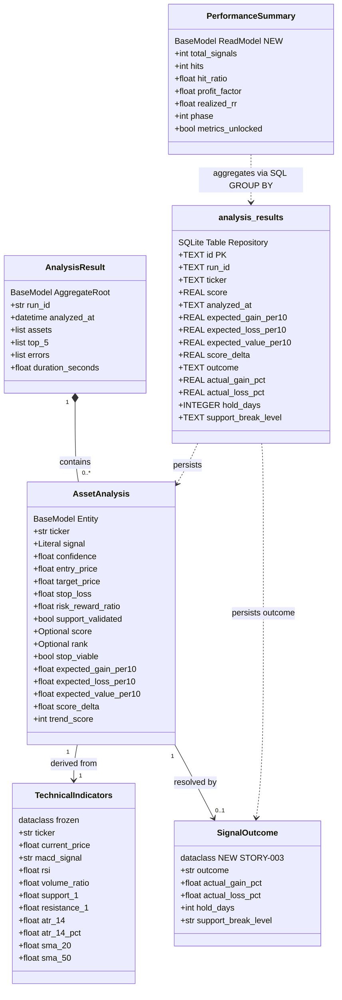
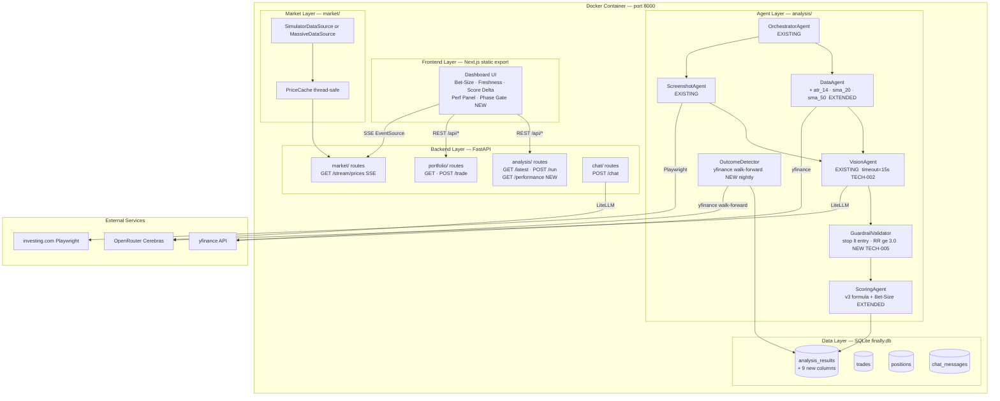
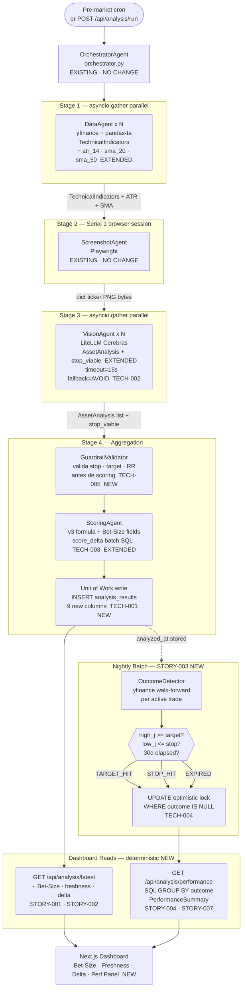
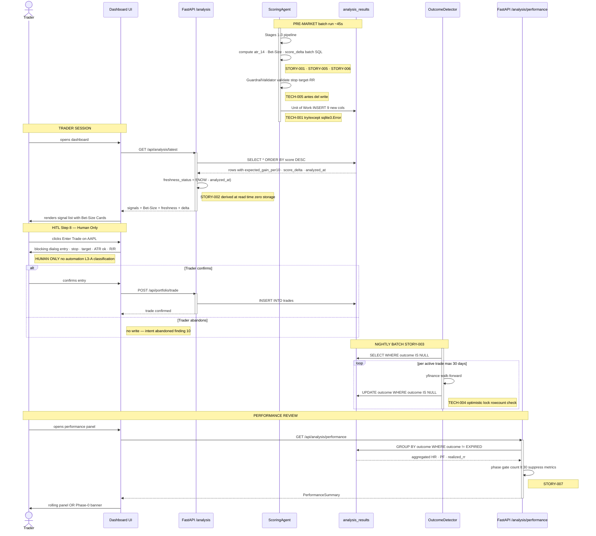
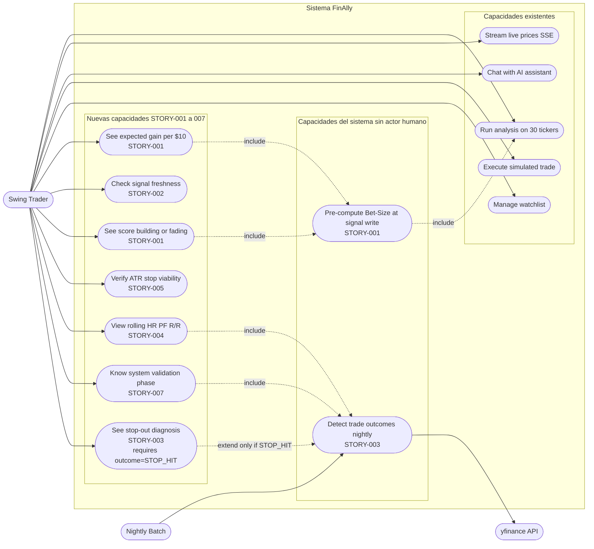
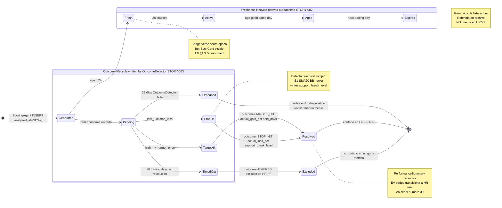
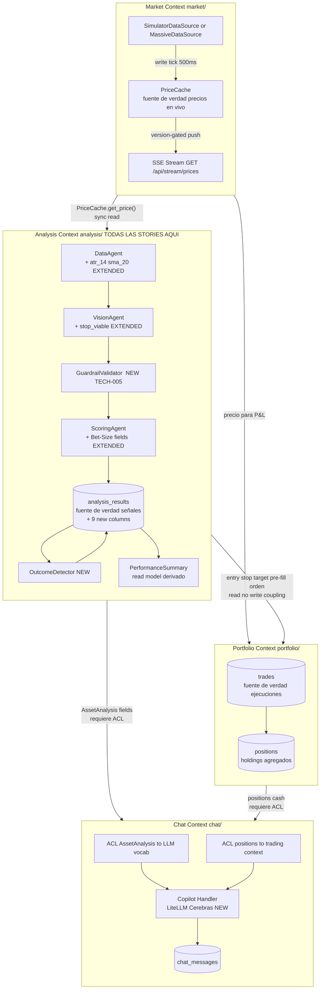

# Domain Architecture — FinAlly MVP
**Skill**: L4-B Domain Architecture Diagrams  
**Scope**: STORY-001 → STORY-007 integradas en el sistema existente  
**Framework**: DDD (Evans) + DDIA (Kleppmann) + Evaluación Sistémica  
**Date**: 2026-05-23

---

## 1. Existing Domain Inventory

Baseline antes de cualquier story. Todo lo nuevo es **aditivo** sobre esta tabla.

| Name | DDD Type | Python Type | File | Key Fields |
|------|----------|-------------|------|------------|
| `TechnicalIndicators` | Value Object | `frozen dataclass` | `data_agent.py` | ticker, macd_signal, rsi, volume_ratio, support_1/2, resistance_1/2 |
| `AssetAnalysis` | Entity | `Pydantic BaseModel` | `models.py` | ticker, signal, confidence, entry/target/stop, rr, support_validated, score, rank |
| `AnalysisResult` | Aggregate Root | `Pydantic BaseModel` | `models.py` | run_id, analyzed_at, assets[], top_5[], errors[], duration_seconds |
| `PriceUpdate` | Value Object | `frozen dataclass (slots)` | `market/models.py` | ticker, price, previous_price, timestamp, change, direction |
| `PriceCache` | Domain Service | `class` | `market/cache.py` | _prices, _version, _lock |

| Agent | File | Stage | Input → Output | Status |
|-------|------|-------|----------------|--------|
| `OrchestratorAgent` | `orchestrator.py` | Root | `[tickers]` → `AnalysisResult` | ✅ spec completo |
| `DataAgent` | `data_agent.py` | Stage 1 ‖ | `ticker` → `TechnicalIndicators` | ✅ spec completo |
| `ScreenshotAgent` | `screenshot_agent.py` | Stage 2 → | `[tickers]` → `dict[str, bytes]` | ✅ spec completo |
| `VisionAgent` | `vision_agent.py` | Stage 3 ‖ | `ticker + indicators + bytes` → `AssetAnalysis` | ✅ spec completo |
| `ScoringAgent` | `scoring_agent.py` | Stage 4 | `[AssetAnalysis]` → `[ranked]` | 🔄 Enhancement v3 en progreso |

---

## 2. Class Diagram

`AnalysisResult` es el aggregate root (DDD): agrupa `AssetAnalysis` y garantiza la consistencia de un run completo. Las stories STORY-001 a STORY-007 son puramente aditivas — 7 campos opcionales nuevos en `AssetAnalysis` (write path, pre-computados por `ScoringAgent`), 4 campos en `TechnicalIndicators` (value object inmutable extendido en DataAgent), y 9 columnas NULL-safe en `analysis_results` (una sola migración). `SignalOutcome` es un nuevo value object que se escribe exactamente una vez por `OutcomeDetector` (DDIA: idempotency). `PerformanceSummary` es un read model derivado puro — compuesto mediante SQL `GROUP BY` en cada request, nunca persistido (DDIA: read path separada del write path).



---

## 3. Architecture Diagram

El sistema vive en un único contenedor Docker — restricción hard del repo (DDIA: single-node architecture con SQLite como store único). Las stories no rompen este boundary: cero nuevos servicios, cero nuevos puertos. El `OrchestratorAgent` es el application service (DDD) que coordina los agentes de dominio; FastAPI es la interfaz de entrada sin lógica de negocio. Los dos componentes nuevos se insertan sin fricción: `OutcomeDetector` es un background job nocturno que escribe en `analysis_results`, y `GET /api/analysis/performance` es lectura pura. El nodo `GuardrailValidator` (TECH-005) representa el boundary explícito entre decisión agéntica (VisionAgent) y reglas duras de negocio (RR ≥ 3.0, ATR floor, stop < entry).



---

## 4. Orchestration Diagram

La pipeline de 4 stages es el **write path** (DDIA): transforma datos externos en `AssetAnalysis` persistidos en `analysis_results`, costosa en tiempo (~45s batch), ejecutada una vez por run. Los dashboards son el **read path**: lecturas pre-computadas sub-200ms. Las stories solo tocan Stage 4 (ScoringAgent extendido) y el nightly batch (OutcomeDetector nuevo) — no modifican la topología ni agregan latencia al critical path del trader. Los nodos de TECH-001 a TECH-004 son visibles como anotaciones en el diagrama porque son precondiciones de corrección, no opcionales.



---

## 5. Sequence Diagram

El único punto de sincronización bloqueante para el trader es `GET /api/analysis/latest` — pero los datos son pre-computados (DDIA: materialized view), por lo que el request es trivialmente rápido. El `POST /api/portfolio/trade` es el punto de irreversibilidad (DDIA: write que no puede deshacerse fácilmente) — flanqueado por blocking confirmation dialog. `OutcomeDetector` es completamente asíncrono respecto al trader. La secuencia expone el score_delta loop como cuello de botella (TECH-003) y el intent-abandoned como estado huérfano sin definir (finding #10).



---

## 6. Use Case Diagram

Las 7 nuevas capacidades del trader pertenecen todas al Analysis Bounded Context (DDD) — no cruzan ninguna frontera de contexto. Los casos de uso del nightly batch son domain services sin actor humano. `See stop-out diagnosis` tiene una pre-condition de dominio estricta: solo disponible cuando `outcome = STOP_HIT` ha sido escrito — la UI debe ocultarla hasta entonces. `Execute simulated trade` es el único caso existente que cruza al Portfolio Context, usando los campos `entry_price/stop_loss/target_price` ya presentes en `AssetAnalysis`.



---

## 7. Agent State Diagram

Una señal tiene dos ciclos de vida **ortogonales y simultáneos** (DDD: múltiples facetas del mismo agregado). Freshness se deriva de `analyzed_at` en tiempo de lectura — DDIA: derived data, cero escrituras adicionales. Outcome se escribe exactamente una vez por `OutcomeDetector` — DDIA: idempotent write con guard `WHERE outcome IS NULL`. El estado `Excluded` es terminal e irreversible por diseño (regla CLT de Kaabar). El estado `Orphaned` (nuevo, TECH-006 finding #12) cubre el caso de edge donde el OutcomeDetector falla persistentemente.



---

## 8. Bounded Context Map

Todas las stories (STORY-001 a STORY-007) son internas al **Analysis Context** — no cruzan fronteras. La única frontera cruzada por las stories es el pre-fill de `entry_price/stop_loss/target_price` desde Analysis al Portfolio Context en Step 9. El Chat Context requiere dos **Anti-Corruption Layers** (DDD): una para traducir `AssetAnalysis` al vocabulario natural del LLM, y otra para traducir `positions` del Portfolio Context.



---

## 9. Systemic Impact Summary

### Write Path Changes

| Story | Escribe | Tabla | Consumidor | Riesgo |
|-------|---------|-------|-----------|--------|
| STORY-001 | `expected_gain_per10`, `score_delta` | `analysis_results` | Dashboard API, EV badge | LOW — NULL-safe, aditivo |
| STORY-003 | `outcome`, `actual_gain_pct`, `hold_days`, `support_break_level` | `analysis_results` | PerformanceSummary, Diagnosis card | MED — debe ser idempotente |
| STORY-005 | `atr_14`, `stop_viable` | `TechnicalIndicators` (in-memory) | ScoringAgent | LOW — sin persistencia |
| STORY-006 | `sma_20`, `sma_50` | `TechnicalIndicators` (in-memory) | ScoringAgent | LOW — sin persistencia |

### Schema Migration (una sola transacción)

```sql
BEGIN TRANSACTION;
ALTER TABLE analysis_results ADD COLUMN expected_gain_per10  REAL;
ALTER TABLE analysis_results ADD COLUMN expected_loss_per10  REAL;
ALTER TABLE analysis_results ADD COLUMN expected_value_per10 REAL;
ALTER TABLE analysis_results ADD COLUMN score_delta          REAL;
ALTER TABLE analysis_results ADD COLUMN outcome              TEXT;
ALTER TABLE analysis_results ADD COLUMN actual_gain_pct      REAL;
ALTER TABLE analysis_results ADD COLUMN actual_loss_pct      REAL;
ALTER TABLE analysis_results ADD COLUMN hold_days            INTEGER;
ALTER TABLE analysis_results ADD COLUMN support_break_level  TEXT;
CREATE INDEX idx_outcome ON analysis_results(outcome);
COMMIT;
```

### What Could Break

| Escenario | Probabilidad | Mitigación |
|-----------|-------------|------------|
| `score_delta` NULL en primer run por ticker | CERTEZA | `COALESCE(score_delta, 0.0)`, UI muestra Stable |
| OutcomeDetector duplica outcome | ALTA si reinicia | `UPDATE WHERE outcome IS NULL` — TECH-004 |
| EV badge no transiciona en señal #30 | MEDIA off-by-one | Test boundary 29 assumed 30 actual |
| `actual_gain_pct` NULL si yfinance retorna NaN | MEDIA | Validar NOT NULL antes de write en OD |
| Migration falla mid-deploy | BAJA | Envolver en transacción test en dev DB primero |

---

## 10. Critical System Evaluation

### Evaluación: Architecture Diagram

**System Type**: Hybrid — Core determinista (85%) + capa agéntica (VisionAgent, Copilot)  
**DDD/DDIA Lens**: DDIA single-node architecture · DDD bounded contexts · Agentic reliability patterns

| # | Dimensión | Hallazgo | Severidad |
|---|-----------|---------|----------|
| 1 | Acoplamiento Determinista | `ScoringAgent` escribe a DB dentro del pipeline — fallo de DB en Stage 4 aborta el run aunque Stages 1-3 completaron. | 🟠 Alta |
| 2 | Cuello de botella Determinista | `analysis_results` es el único punto de escritura. Con múltiples runs simultáneos, SQLite write lock es el cuello de botella sistémico. | 🟡 Media |
| 3 | Guardrails agénticos | No hay boundary arquitectónico explícito entre decisión agéntica (VisionAgent) y reglas duras de negocio. Un LLM puede generar `stop_loss > entry_price`. | 🟠 Alta |
| 4 | Observabilidad | No hay componente de telemetría visible. Sin logging por stage, un run lento no puede diagnosticarse. | 🟠 Alta |

**Design Patterns**:
- Finding 1 → **Unit of Work**: envolver INSERT en `try/except sqlite3.Error`, asset fallido va a `errors[]`, run continúa.
- Finding 3 → **Explicit Guardrail Layer**: nodo `GuardrailValidator` entre VisionAgent y ScoringAgent que valida invariantes estructurales.
- Finding 4 → **Structured Logging**: componente `AnalysisTelemetry` que registra `duration_ms`, `error_count`, y `signals_generated` por stage y por run.

---

### Evaluación: Orchestration Diagram

**System Type**: Hybrid — Staged Fan-out determinista + VisionAgent agéntico  
**DDD/DDIA Lens**: DDIA write path optimization · Agentic reliability patterns

| # | Dimensión | Hallazgo | Severidad |
|---|-----------|---------|----------|
| 5 | Error Compounding Agéntico | 4 stages en secuencia × N tickers. Con 90% éxito/agente y 4 stages: tasa de éxito completo ≈ 65%. No visible en el diagrama. | 🔴 Crítico |
| 6 | Timeout Agéntico | Sin timeout explícito en VisionAgent. LLM lento congela el run completo. | 🔴 Crítico |
| 7 | Fallback Path Agéntico | Solo happy path visible. Sin ruta alternativa si ScreenshotAgent falla o VisionAgent retorna JSON inválido. | 🔴 Crítico |
| 8 | Race condition Determinista | `OutcomeDetector` sin optimistic lock — dos instancias simultáneas pueden escribir outcomes duplicados. | 🟠 Alta |

**Design Patterns**:
- Findings 5, 6, 7 → **Reliability Engineering**: timeout configurable vía env var + degraded fallback visible en el diagrama. Per-asset error isolation (ya soportado por `errors[]`) debe ser explícito en el diagrama.
- Finding 8 → **Optimistic Locking**: `UPDATE SET outcome=? WHERE id=? AND outcome IS NULL`. Si `rowcount == 0`, skip con INFO log.

---

### Evaluación: Sequence Diagram

**System Type**: Hybrid — flujo del trader determinista + copilot agéntico  
**DDD/DDIA Lens**: DDIA synchronous coordination · DDD aggregate invariants

| # | Dimensión | Hallazgo | Severidad |
|---|-----------|---------|----------|
| 9 | Cuello de botella Determinista | `score_delta` SQL lookup síncrono dentro del loop de Stage 4 — 30 queries secuenciales con 30 tickers. | 🟡 Media |
| 10 | Estado huérfano Determinista | Sin estado definido para "trader abre dashboard, pre-llena orden, cierra sin confirmar". El trade nunca se registra pero el usuario puede creer que sí entró. | 🟡 Media |
| 11 | Gap de notificación Agéntico | `OutcomeDetector` escribe outcomes de noche pero no hay push notification. El trader debe refrescar manualmente. | 🟡 Media |

**Design Patterns**:
- Finding 9 → **Batch SQL**: una sola query al inicio de Stage 4, resultado en dict Python, sin I/O dentro del loop.
- Finding 10 → Documentar en L3-D UX spec como edge case del Step 9 — "intent abandoned timeout".
- Finding 11 → Evaluar SSE outcome event cuando OutcomeDetector detecta TARGET_HIT o STOP_HIT.

---

### Evaluación: Agent State Diagram

**System Type**: Deterministic — transiciones gobernadas por reglas matemáticas exactas  
**DDD/DDIA Lens**: DDD aggregate invariants · DDIA idempotency

| # | Dimensión | Hallazgo | Severidad |
|---|-----------|---------|----------|
| 12 | Estado huérfano Determinista | `Pending` sin transición de recovery si `OutcomeDetector` falla persistentemente 35+ días. Trade queda en limbo sin diagnóstico. | 🟠 Alta |
| 13 | Idempotencia Determinista | `actual_gain_pct` puede escribirse como NULL si yfinance retorna NaN para una barra específica. | 🟡 Media |
| 14 | Coexistencia de estados Determinista | Señal `Expired` (freshness) con `outcome=Pending` (activo). La UI no debe filtrar outcomes por freshness en el historial de trades. | 🟡 Media |

**Design Patterns**:
- Finding 12 → Estado `Orphaned` como transición de recovery. Si OutcomeDetector no resuelve un trade después de 35 días, transicionar a Orphaned visible en UI con diagnóstico "revisar manualmente".
- Finding 13 → Validar `actual_gain_pct IS NOT NULL` antes del write. Si NaN, skip y retry en próximo run.
- Finding 14 → Filtro de freshness aplica solo a lista activa. Historial de outcomes muestra todas las señales con outcome independientemente de freshness.

---

## 11. Technical Tasks from Evaluation

### TECH-001: Unit of Work en Stage 4
**Source**: Finding #1 — Architecture Diagram · **Severidad**: 🟠 Alta · **System type**: Deterministic  
**Finding**: Fallo de DB en Stage 4 aborta run completo aunque Stages 1-3 completaron.  
**Riesgo**: Runs parcialmente exitosos no se persisten; trader no ve resultados en fallos transitorios.

```python
# scoring_agent.py
try:
    cursor.execute("INSERT INTO analysis_results ...", values)
    conn.commit()
except sqlite3.Error as e:
    logger.error("DB write failed for %s: %s", ticker, e)
    asset.rank = None
    errors.append({"ticker": ticker, "error": str(e)})
```

**Acceptance criteria**:
- [ ] Fallo de INSERT para un ticker → run continúa con los demás tickers
- [ ] Ticker fallido aparece en `AnalysisResult.errors[]`
- [ ] `test_scoring_agent.py` cubre `sqlite3.OperationalError` durante write
- [ ] `OrchestratorAgent` retorna resultados parciales con errors[]

**Effort**: Low 2-3h · **Sprint**: Slice 0 · **Blocks**: STORY-001, STORY-003

---

### TECH-002: Timeout + Fallback explícito en VisionAgent
**Source**: Findings #6, #7 — Orchestration Diagram · **Severidad**: 🔴 Crítico · **System type**: Agentic  
**Finding**: Sin timeout, LLM lento congela el run. Sin fallback visible, excepción colapsa el análisis del ticker.

```python
# vision_agent.py
try:
    response = litellm.completion(
        model=MODEL, messages=prompt,
        response_format=AssetAnalysis,
        timeout=int(os.getenv("VISION_AGENT_TIMEOUT", 15))
    )
except litellm.Timeout:
    logger.warning("VisionAgent timeout for %s", ticker)
    return AssetAnalysis(ticker=ticker, signal="AVOID",
                         confidence=0, argument="Analysis unavailable — timeout")
```

**Acceptance criteria**:
- [ ] `timeout` configurable vía `VISION_AGENT_TIMEOUT` env var (default: 15)
- [ ] Timeout retorna degraded `AssetAnalysis`, nunca propaga excepción
- [ ] `test_vision_agent.py`: mock `litellm.Timeout` → degraded result
- [ ] Diagrama de orquestación actualizado con ruta de fallback visible

**Effort**: Low 1-2h · **Sprint**: Slice 0 · **Blocks**: ninguno

---

### TECH-003: Batch SQL para score_delta
**Source**: Finding #9 — Sequence Diagram · **Severidad**: 🟡 Media · **System type**: Deterministic  
**Finding**: 30 queries secuenciales para `score_delta` dentro del loop de Stage 4.

```python
# scoring_agent.py — ANTES del loop
prior = db.execute(
    "SELECT ticker, score FROM analysis_results WHERE run_id = "
    "(SELECT run_id FROM analysis_results ORDER BY analyzed_at DESC LIMIT 1 OFFSET 1)"
).fetchall()
prior_scores = {r["ticker"]: r["score"] for r in prior}

# DENTRO del loop (sin I/O):
score_delta = round(score - prior_scores.get(ticker, score), 2)
```

**Acceptance criteria**:
- [ ] Una sola query SQL fuera del loop (no N queries dentro)
- [ ] `score_delta = 0.0` cuando no hay run previo
- [ ] Test: delta correcto entre dos runs consecutivos

**Effort**: Low 1h · **Sprint**: Slice 1

---

### TECH-004: Optimistic locking en OutcomeDetector
**Source**: Finding #8 — Orchestration Diagram · **Severidad**: 🟠 Alta · **System type**: Deterministic  
**Finding**: Dos instancias simultáneas pueden escribir outcomes duplicados corrompiendo HR/PF.

```python
# outcome_detector.py
rows = db.execute(
    "UPDATE analysis_results SET outcome=?, actual_gain_pct=?, hold_days=? "
    "WHERE id=? AND outcome IS NULL",
    (outcome, gain_pct, hold_days, signal_id)
).rowcount

if rows == 0:
    logger.info("Outcome already written for %s — skipping (idempotent)", ticker)
```

**Acceptance criteria**:
- [ ] `UPDATE WHERE outcome IS NULL` — atómico
- [ ] `rowcount == 0` logueado como INFO, no como error
- [ ] Test: 2 runs → métricas idénticas

**Effort**: Low 1h · **Sprint**: Slice 0 · **Blocks**: STORY-004

---

### TECH-005: GuardrailValidator entre VisionAgent y ScoringAgent
**Source**: Finding #3 — Architecture Diagram · **Severidad**: 🟠 Alta · **System type**: Agentic  
**Finding**: LLM puede generar `AssetAnalysis` con `stop_loss > entry_price` que llegaría al dashboard.

```python
# scoring_agent.py
def validate_asset_analysis(asset: AssetAnalysis) -> tuple[bool, str]:
    if asset.entry_price <= 0:          return False, "entry_price <= 0"
    if asset.stop_loss >= asset.entry_price:   return False, "stop_loss >= entry_price"
    if asset.target_price <= asset.entry_price: return False, "target_price <= entry_price"
    if asset.risk_reward_ratio < 0:     return False, "negative R/R"
    return True, ""

# Antes del loop de scoring:
valid, reason = validate_asset_analysis(asset)
if not valid:
    asset.rank = None
    errors.append({"ticker": asset.ticker, "error": f"structural_invalid: {reason}"})
    continue
```

**Acceptance criteria**:
- [ ] `validate_asset_analysis` ejecuta antes del scoring loop
- [ ] Assets inválidos tienen `rank=None` y aparecen en `errors[]`
- [ ] `test_scoring_agent.py` cubre los 4 casos de validación fallida
- [ ] Architecture Diagram actualizado con nodo `GuardrailValidator`

**Effort**: Low 2h · **Sprint**: Slice 0 · **Blocks**: ninguno

---

### TECH-006: Structured logging por stage en OrchestratorAgent
**Source**: Finding #4 — Architecture Diagram · **Severidad**: 🟠 Alta · **System type**: Hybrid  
**Finding**: Sin logging estructurado por stage, un run lento no puede diagnosticarse en producción.

```python
# orchestrator.py
import time, logging
logger = logging.getLogger("finally.orchestrator")

t_stage = time.time()
# al finalizar cada stage:
logger.info("stage_complete", extra={
    "stage": 1, "run_id": run_id,
    "duration_ms": int((time.time() - t_stage) * 1000),
    "tickers": len(tickers),
    "errors": sum(1 for r in results if isinstance(r, Exception))
})
# al finalizar el run:
logger.info("run_complete", extra={
    "run_id": run_id,
    "total_ms": int((time.time() - t_start) * 1000),
    "signals_generated": len(top_5),
    "error_count": len(errors)
})
```

**Acceptance criteria**:
- [ ] Cada stage emite: `duration_ms`, `tickers`, `error_count`
- [ ] Run completo emite: `run_id`, `total_ms`, `signals_generated`, `error_count`
- [ ] Logs son JSON estructurado (no f-strings)
- [ ] `AnalysisResult.duration_seconds` lleno con tiempo real del run

**Effort**: Medium 3-4h · **Sprint**: Slice 1

---

## 12. Pre-Development Checklist

**Schema & Data Layer**
- [ ] Migration (9 ALTER TABLE) ejecutada en transacción, testeada en dev DB
- [ ] Index `idx_outcome` creado
- [ ] SQLite ≥ 3.35 confirmada en Docker image

**ScoringAgent (STORY-001, 005, 006)**
- [ ] `score_delta` batch SQL (TECH-003) — una query, no N queries
- [ ] `expected_value_per10` guarded: `if entry_price > 0`
- [ ] `GuardrailValidator` antes de scoring (TECH-005)
- [ ] Unit of Work en write (TECH-001)
- [ ] `test_scoring_agent.py` actualizado: batch delta, validación estructural, DB error

**DataAgent (STORY-005, 006)**
- [ ] `atr_14`, `atr_14_pct`, `sma_20`, `sma_50` en `TechnicalIndicators`
- [ ] `dropna()` después de toda computación de indicadores
- [ ] `test_data_agent.py` actualizado con NaN en mock yfinance

**VisionAgent**
- [ ] `timeout=15` vía `VISION_AGENT_TIMEOUT` (TECH-002)
- [ ] Degraded fallback testeado con `litellm.Timeout` mock

**OutcomeDetector (STORY-003)**
- [ ] Optimistic locking `UPDATE WHERE outcome IS NULL` (TECH-004)
- [ ] `actual_gain_pct` validado NOT NULL antes de write
- [ ] Test idempotencia: 2 runs → mismos resultados

**OrchestratorAgent**
- [ ] Structured logging por stage (TECH-006)
- [ ] Per-asset error isolation: fallo de un ticker no aborta run

**PerformanceSummary (STORY-004, 007)**
- [ ] Phase gate: 29 → sin métricas, 30 → unlocked
- [ ] EXPIRED excluidos del HR/PF
- [ ] Zero-division guard: `sum_losses = 0` → 999.0
- [ ] EV badge boundary: 29 → "@ 35% assumed", 30 → "@ N% realized"
